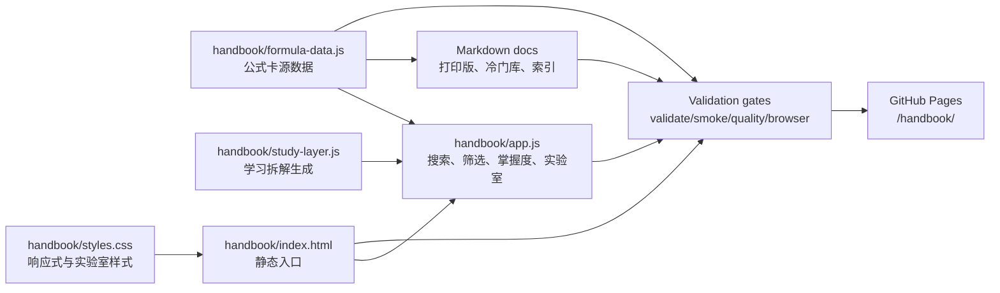

# Architecture / 架构说明

This project is intentionally small in tooling and strict in validation. The handbook is a static learning app, so reliability comes from clear data ownership, generated artifacts, and automated checks rather than from a heavy framework.

本项目刻意保持工具链轻量，但对校验很严格。手册是纯静态学习应用，因此可靠性主要来自清晰的数据源、生成产物和自动化门禁，而不是复杂框架。

## System Shape / 系统形态



## Source of Truth / 数据源原则

- `handbook/formula-data.js` is the source of truth for formula cards.
- Generated Markdown files are outputs, not source files.
- `handbook/study-layer.js` enriches cards at runtime and in quality checks; it should not silently replace missing card content.
- `COVERAGE.md` is generated by `handbook/coverage-report.js` and represents the current coverage baseline.

When changing content, edit `formula-data.js`, then run `npm run verify`. Do not hand-edit generated docs to “fix” output drift.

## Runtime Flow / 运行时流程

1. `index.html` loads MathJax, `study-layer.js`, `formula-data.js`, and `app.js`.
2. `formula-data.js` registers `window.FORMULA_CARDS` and `window.FORMULA_GROUPS`.
3. `app.js` builds navigation, cards, search results, mastery state, recommendations, and labs.
4. Mastery, favorites, and review queues live in browser `localStorage`.
5. Interactive labs render with inline SVG/DOM controls. They are teaching aids, not symbolic calculators.

## Data Model / 公式卡模型

Each card should keep these fields meaningful:

- `id`: stable unique id used by relations, tests, and links.
- `subject`, `chapter`, `section`: navigation and coverage grouping.
- `title`, `latex`, `importance`, `tags`: searchable card identity.
- `conditions`, `intuition`, `howToUse`, `miniProof`, `example`, `mistakes`: learning layer.
- `interactiveType`: optional lab binding.
- `relatedFormulas`: optional explicit relation list.

The validator also enforces duplicate-title checks, interactive type validity, raw control-character detection, LaTeX command sanity, and minimum lab bindings for core labs.

## Generated Artifacts / 生成产物

Generated files:

- `考研数学一-公式手册-完整版.md`
- `考研数学一-冷门技巧公式库.md`
- `考研数学一-总索引.md`
- `COVERAGE.md`

Generation commands:

```bash
npm run docs
npm run coverage
npm run generated:check
```

`generated-check.js` runs after generation and fails if generated files still differ from the working tree, or if generated Markdown contains raw control characters.

## Validation Layers / 质量门禁

`npm run verify` is the default local gate:

1. `check:syntax`: JavaScript syntax for app and tool scripts.
2. `validate`: formula schema, chapter coverage, interactive types, LaTeX sanity.
3. `docs`: regenerate Markdown docs.
4. `coverage`: regenerate `COVERAGE.md`.
5. `generated:check`: prevent generated-output drift.
6. `smoke`: fake-DOM initialization and key runtime wiring.
7. `quality`: learning-depth and lab-coverage maturity gates.
8. `links`: Markdown links, HTML assets, required project files, package metadata.
9. `repo:hygiene`: LF line endings and raw control-character checks.
10. `pages:prepare`: clean GitHub Pages artifact assembly.

Browser-level gates:

```bash
npm run verify:browser
npm run verify:browser:live
```

They exercise desktop/mobile behavior, MathJax, sidebar scrolling, lab opening paths, lab controls, keyboard shortcuts, and versioned assets.

## Deployment / 部署流程

GitHub Pages is deployed from a prepared artifact:

1. `npm run verify`
2. `npm run pages:prepare`
3. `actions/upload-pages-artifact`
4. `actions/deploy-pages`
5. `npm run verify:deploy`
6. live Chromium smoke against the deployed `/handbook` URL

The deployment workflow is intentionally stricter than a simple static upload because the project depends on labs actually opening online, not only on files existing.

## Design Constraints / 设计约束

- Keep the runtime static: no backend, no database, no build step.
- Avoid framework migration unless the maintainability gain is clear and documented.
- Prefer readable Vanilla JS over clever abstractions.
- Keep formulas inspectable in source and generated Markdown.
- New labs should teach a concrete idea and include a clear observation task.
- Large content changes should update coverage, docs, and relevant checks together.

## Common Change Paths / 常见修改路径

### Add or fix a formula card

1. Edit `handbook/formula-data.js`.
2. Keep `id` stable unless the old card is truly removed.
3. Fill conditions, intuition, usage, proof, example, and mistakes.
4. Run `npm run verify`.
5. Review generated Markdown diff.

### Add a new lab type

1. Add the `interactiveType` to `validate-data.js`.
2. Implement rendering in `app.js`.
3. Add styles in `styles.css`.
4. Add or update smoke/browser checks.
5. Bind at least a few relevant cards.
6. Run local and browser validation.

### Change deployment behavior

1. Update `.github/workflows/pages.yml`.
2. Update `handbook/prepare-pages.js` or `handbook/deploy-health.js` if needed.
3. Update `RELEASE_CHECKLIST.md` and `ARCHITECTURE.md` when the flow changes.
4. Confirm both `Verify handbook` and `Deploy Pages` workflows pass.

